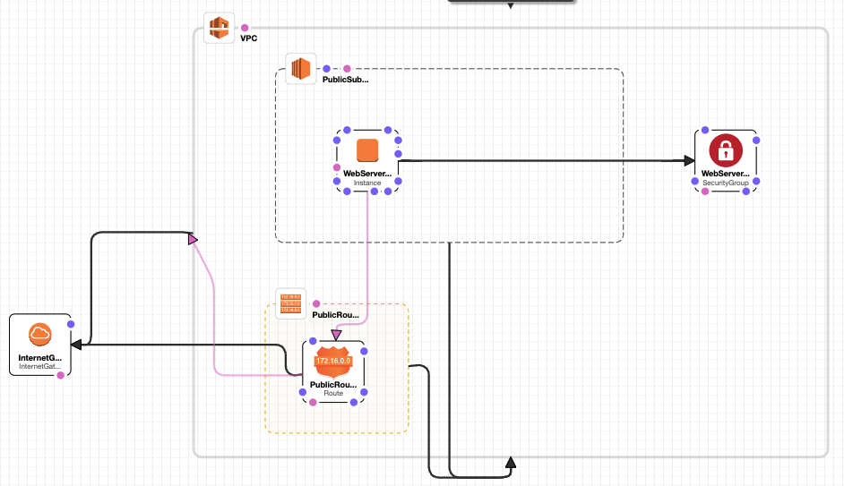

# Templates In-Depth
<!-- TOC -->

- [Templates In-Depth](#templates-in-depth)
- [Sections In-Depth](#sections-in-depth)
  - [AWSTemplateFormatVersion](#awstemplateformatversion)
  - [Description](#description)
  - [Metadata](#metadata)
  - [Parameters](#parameters)
  - [Mappings](#mappings)
  - [Conditions](#conditions)
  - [Transform](#transform)
  - [Resources](#resources)
  - [Outputs](#outputs)
- [Intrinsic Functions](#intrinsic-functions)
- [CloudFormation Pseudo Parameters](#cloudformation-pseudo-parameters)
- [Condition Functions](#condition-functions)
- [Template Best Practices](#template-best-practices)

<!-- /TOC -->
---
# Sections In-Depth
## AWSTemplateFormatVersion
* Identifies the capability of the template
* The latest template version is `2010-09-09`, and is the only current valid version.
## Description
* The Description is optional, but if included, must come after the `AWSTemplateFormatVersion`.
## Metadata
* Allows inclusion of arbitrary objects that provide details about the template.
* Examples would be providing detailed information about a database or web application you are creating.
## Parameters
* Parameters allow you to pass values into your template when you create a stack.
* Each parameter specified must contain a value when you create a stack.
## Mappings
* Mappings match a key to a corresponding set of named values.
* A common use of Mappings is to map an instance type to an architecture or an AMI ID.
## Conditions
* Includes statements that define when a resource is created or when a property is defined.
* You might use Conditions when you want to reuse a template that can create different resources in different contexts.
* Example: `dev` vs `prod` environment. You could use a Condition to deploy different sized instances based on the environment.
* To use Conditions, you need to incorporate 3 sections of the templates:
  * Parameters - what do you want to evaluate for your condition
  * Condition
  * Resource or Output - the resource or output you want to conditionally create
## Transform
* Specifies one or more Transforms that CF uses to process your template. You can simplify templates by condensing and reusing template components.
* Two kinds of Transforms: `AWS::Serverless` and `AWS::Include`
* Serverless refers to Lambda functions
* Includes are very much like includes in programming languages. You can include code snippets in your template.
## Resources
* The only required element in a template. Every resource that you need in your stack will be declared in this section.
## Outputs
* Declares output values that will be displayed in CF Outputs tab, after your stack is created.
* Also can be used for Cross-Stack references: output stack values that can be imported into other stacks.
---
# Intrinsic Functions
* Intrinsic functions are built-in CF functions that allow you to dynamically assign values to properties at run-time.
* They can only be used in certain parts of a stack: resource properties, outputs, metadata attributes, and update policy attributes.
* They can be used to conditionally create stacks.
---
# CloudFormation Pseudo Parameters
* Pseudo parameters are parameters that are predefined by AWS CloudFormation.
* You do not declare them in your template, use them as you would a parameter, as the argument for the Ref function.
* Pseudo parameters:
  * `AWS::Region`
  * `AWS::AccountId`
  * `AWS::NotificationARNs`
  * `AWS::NoValue`
  * `AWS::Partition`
  * `AWS::StackId`
  * `AWS::StackName`
  * `AWS::URLSuffix`
---
# Condition Functions
* Use condition functions to conditionally create stack resources.
* They are evaluated based on input parameters to the template.
* You define conditions in the Conditions section of a template.
* `Fn::If` can be used in the metadata attribute, update policy attribute, and property values in the resources and output sections.
* Use conditions when you want to reuse a template to create resources in different contexts, e.g. dev or prod.
* CF condition functions (`!` is NOT the boolean not, but a YAML short form notation for `Fn::`):
  * `!And`
  * `!Equals`
  * `!If`
  * `!Not`
  * `!Or`

For example: If optional parameter `DBSnapshotName` is not empty, then condition `UseDBSnapshot` is true.

If `UseDBSnapshot` is true, set `DBSnapshotIdentifier` to reference ID of `DBSnapshotName`, otherwise set to `AWS::NoValue`.
```yml
Parameters:
  ...
  DBSnapshotName:
    Description: The name of a DB snapshot (optional)
    Default: ""
    Type: String

  Conditions:
    UseDBSnapshot: !Not !Equals
      - !Ref DBSnapshotName
      - ""

  Resources:
    MyDB:
      Type: AWS::RDS::DBInstance
      Properties:
        ...
        DBSnapshotIdentifier:
          !If:
            - UseDBSnapshot
            - !Ref DBSnapshotName
            - !Ref AWS::NoValue
```
---
# Template Best Practices
* Reuse templates to replicate stacks in multiple environments.
  * Nested stacks can also used as a means to reuse common template patterns.
* Don't embed credentials in your templates.
  * Use input parameters to pass information whenever you create or update a stack.
  * For additional security, you can use the `NoEcho` property to obfuscate the parameter value.
* Use parameter constraints.
  * Don't allow users to enter invalid paramter values.
  * Example: Set constraints on a DB password to ensure that it will comply with the rules you've set for the password.
* Validate templates before using them.
  * Use CF Designer to validate your template before stack creation.
  * Validating a template can help you catch syntax and some semantic errors, such as circular dependencies, before CF creates any resources.
* This is IaC, so use best practices such as code reviews, and revision controls to manage your templates.

Example: Webserver in a VPC



[Source Code](../src/arcu2022/lab2_vpc_web.yml)